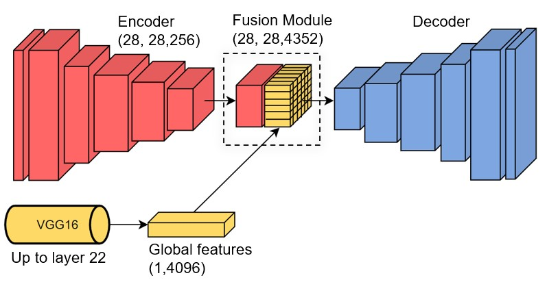
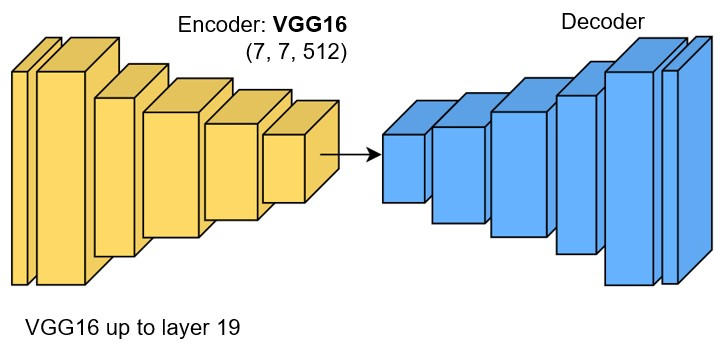
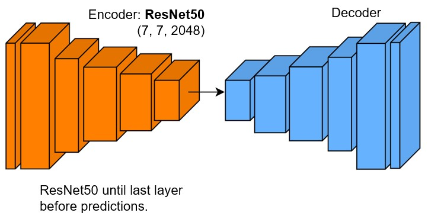

# VideoColorization
This is my repo for the project **Automatic Video Colorization with Deep Learning**  
**David Norman Díaz Estrada**  
davidnd@stud.ntnu.no  

In this project, I explored different encoder-decoder architectures for Image Colorization based on L*a*b* color space and created a framework for Automatic Video Colorization.
I cleaned the Places 365 dataset and trained 5 different models from scratch. I used VGG16 and ResNet50 for the transfer learning. Model M5 gave the best results with ResNet50 as the backbone. 

------------------
**TRAINED COLORIZATION NETWORKS:**  
------------------
I trained a total of 5 image colorization networks (models M1 to M5) and developed a framework to adapt it for Video Colorization. 
All the trained models are available in: [LINK](https://drive.google.com/drive/folders/1G1y8EGjSEvJBssqf1bIsurxtI1YDItSk) 

Network Architecture: M1 
Architecture followed in [[1]](https://xiangyutang2.github.io/auto-colorization-autoencoders/.) and similar to [[2]](http://arxiv.org/abs/1712.03400
). 
 

Network Architecture: M2 to M4 
Architecture followed in [[3]](https://github.com/bnsreenu/python_for_microscopists/blob/master/092-autoencoder_colorize_transfer_learning_VGG16_V0.1.py). 
 

Network Architecture: M5 
 

Summary of model architectures: 

------------------
**DATASETS:**
------------------
1. Places 365 full dataset (cleaned):  
  - Available in: [LINK](https://drive.google.com/file/d/1jrqI_UkrKGnx93iLvNgPcBjK_Akbeus9/view) 
  - Total Images: 35,622

2. Places 365 dataset (cleaned) used for training models M1 to M5:
  - Available in: [LINK](https://drive.google.com/drive/folders/11tmAGqHGnflChipc5xCx5GVjlZonXQQs) 
  - Total Images: 11,000
  - Training Images: 10,000
  - Testing Images: 1,000

------------------
**FILES IN THIS REPO:** 
------------------

Demo script that allows to run either Image or Video Colorization with any of the trained models:
- Image_and_video_colorization_demo.ipynb

The following files contain the scripts used to train the models M1 to M5:
- M1_training.ipynb
- M2_training.ipynb
- M3_training.ipynb
- M4_training.ipynb
- M5_training.ipynb

The MATLAB script used for cleaning the Places365 dataset and the list of discarded images correspond to the following files:
- dataset_cleaning.m
- eraseGrayscaleImgs.txt

------------------
**RESULTS:** 
------------------

