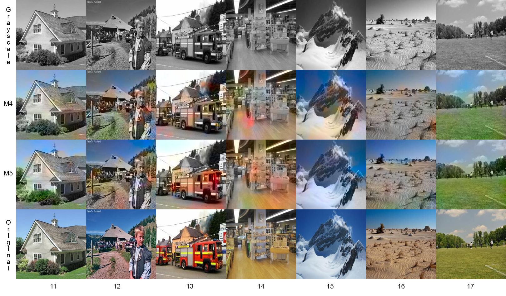
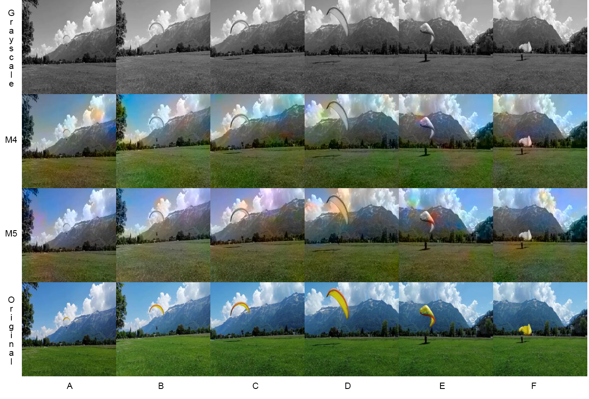

# VideoColorization
This is my repo for the project **Automatic Video Colorization with Deep Learning**  
**David Norman Díaz Estrada**  
davidnd@stud.ntnu.no  

------------------
**TRAINED COLORIZATION NETWORKS:**  
------------------
For this project I trained a total of 5 image colorization networks (models M1 to M5) and developed a framework to adapt it for Video Colorization. 
All the trained models are available in: [LINK](https://drive.google.com/drive/folders/1G1y8EGjSEvJBssqf1bIsurxtI1YDItSk) 

------------------
**DATASETS:**
------------------
1. Places 365 full dataset (cleaned):  
  - Available in: [LINK](https://drive.google.com/file/d/1jrqI_UkrKGnx93iLvNgPcBjK_Akbeus9/view) 
  - Total Images: 35,622

2. Places 365 dataset (cleaned) used for training models M1 to M5:
  - Available in: [LINK](https://drive.google.com/drive/folders/11tmAGqHGnflChipc5xCx5GVjlZonXQQs) 
  - Total Images: 11,000
  - Training Images: 10,000
  - Testing Images: 1,000

------------------
**FILES IN THIS REPO:** 
------------------

Demo script that allows to run either Image or Video Colorization with any of the trained models:
- Image_and_video_colorization_demo.ipynb

The following files contain the scripts used to trained the models M1 to M5:
- M1_training.ipynb
- M2_training.ipynb
- M3_training.ipynb
- M4_training.ipynb
- M5_training.ipynb

The MATLAB script used for cleaning the Places365 dataset and the list of discarded images correspond to the following files:
- dataset_cleaning.m
- eraseGrayscaleImgs.txt

------------------
**RESULTS:** 
------------------

